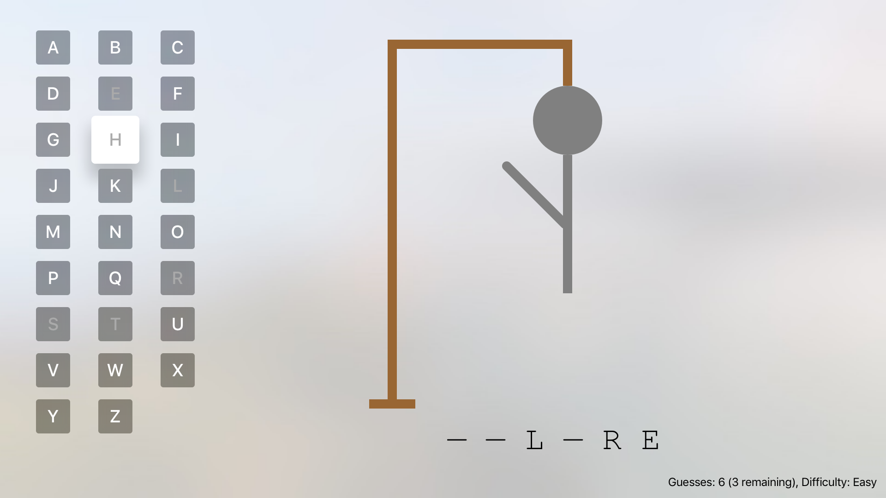

Hangman TV
----------
A simple hangman game for tvOS. Designed after a homework assignment from
[UMBC CMSC 491, 2009](https://cs491f09.wordpress.com/2009/10/14/assignment-5/), 
to be a quick dive into Swift and the tvOS SDK.

Wordlists were derived by Daniel J. Hood, from
[SCOWL](http://wordlist.aspell.net), which is maintained by Kevin Atkinson.

